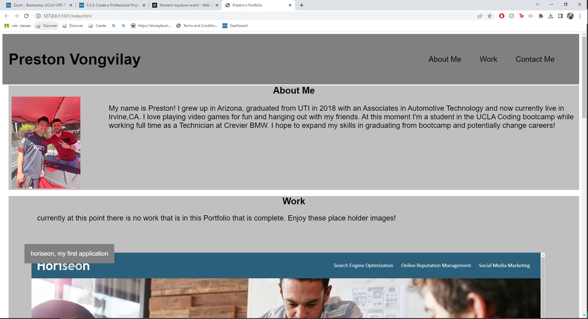

# my-portfolio

## Description
This is my personal portfolio, that is still in progress. I will be adding more to my work when i am able to showcase more of my work! -
-My motivation begin this was that i am able to show off my previous work, tell you about my self and a way to contact me in my own creative way.
-I built this project because its my portfolo! i will be using this for as long as i am a developer
-I learned that it was pretty hard trying to make a application with my own code, and this is because i am just a beginner at this so i am still learning. 

## Usage 
You're able to navigate through my page using the quick links up top. At the bottom of the page youre able to find my contact links and youre able to click the images to view the deployed applications

## License
Please refer to the License in the repo
## Credits
Sangeetha Kaliaperumal, she had assisted with some code when i had trouble.